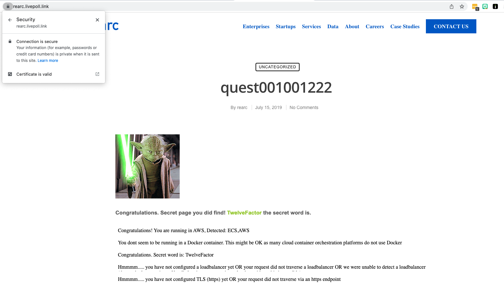
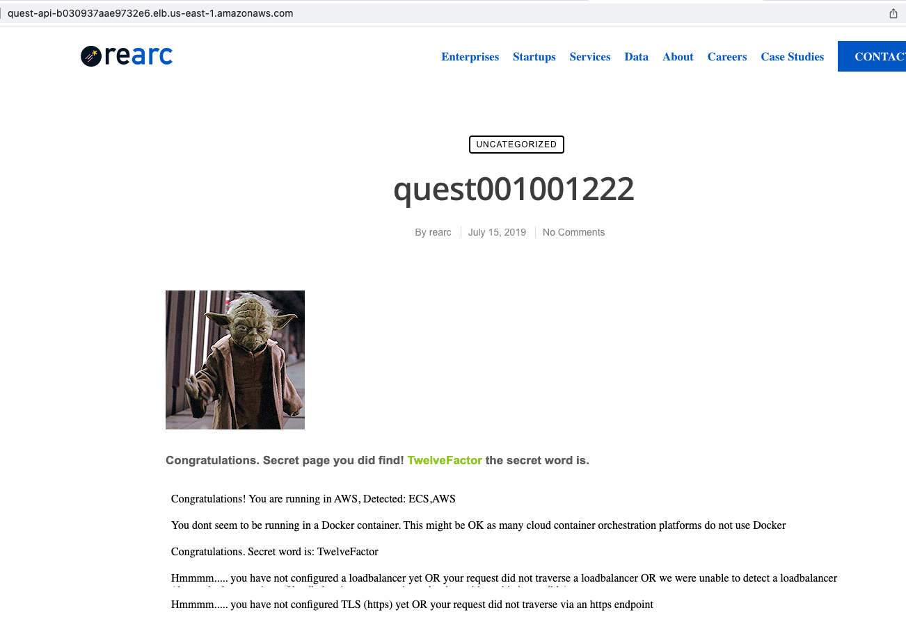
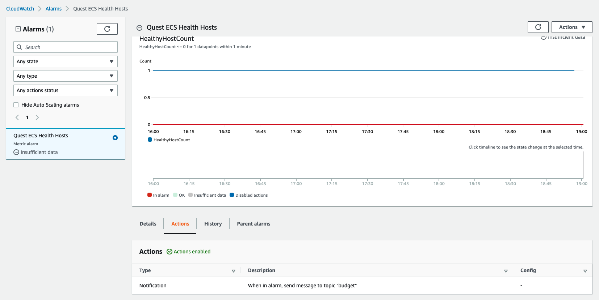
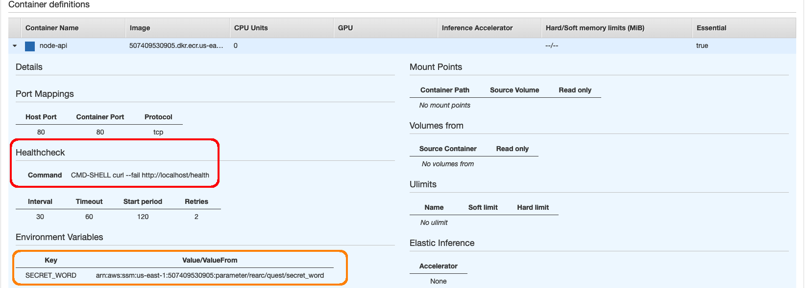

# Rearc Quest

Deployed application: https://rearc.livepoll.link/


A code challenge to assess cloud skills.

Completed by Edan Schwartz for Rearc, Aug 5, 2022.

See [INSTRUCTIONS.md](./INSTRUCTIONS.md)

## Background

I approached this challenge as if it were for a client. Knowing the story of this imaginary client helped focus my efforts and prioritize some work over others:

- They are new to cloud technology, and looking for a proof of concept to deploy containers.
- They do not yet have a "cloud strategy". The goal here is not to create one for them, but give them a concrete starting point, from which they can consider different approaches.

As such, my approach is to:
- Deploy a system that is as minimal as possible.
- Avoid opinionated architecture decisions, but surface those considerations in written documented.
- Reasonably limit my time investment, as the client is not yet paying for our services. But also give them enough to understand our approach as an organization.

## Solution

The deployed system includes:

- A private **docker image registry**, using AWS ECR
- An AWS ECS Fargate cluster, running a single container for the provided Node.js server
- A secret value held in AWS SSM parameter store, and pulled in as an environment variable to the ECS service.
- A load balancer routing traffic to the ECS service, using AWS NLB
- A TLS certificate generated by AWS ACM, verified via AWS Route 53, and attached to the load balancer.
- A CloudWatch alarm that will send an SMS message if the ECS health check fails (ie, a `GET /health` request does not return 2xx) 


### Screenshots

**Live Site**

At https://rearc.livepoll.link


_Notes_

> you have not configured TLS (https) yet OR your request did not traverse via an https endpoint

There is in fact a valid TLS certificate on the domain, as shown in this screenshot. This could be failing because TLS is terminating at the load balancer. 

**Load balancer public DNS**

http://quest-api-b030937aae9732e6.elb.us-east-1.amazonaws.com/



> you have not configured a loadbalancer yet OR your request did not traverse a loadbalancer OR we were unable to detect a loadbalancer

My guess is that the load balancer is not detected because we're using a Network Load Balancer (NLB), not an Application Load Balancer (ALB). NLBs forward TCP traffic directly to the origin server, so, for example, there wouldn't be a `X-Forwarded-For` header.

**ECS Health Checks**

There is CloudWatch metric on ECS HealthyHost counts:



Host health is determined by the health check configured on the ECS task. In this case, the container is making a request to `GET /health` and expecting a HTTP 2xx response:

```js
// Add this endpoint to 000.js
app.get('/health', function (req, res) {
  res.sendStatus(200);
});
```

ECS Task Configuration:



In addition to the health check, you can see that the `SECRET_WORD` environment variable is coming from SSM Parameter store. This has a few advantages:

- Keep the environment variable out of shared code (eg, in terraform config)
- Allow fine-grained access control to secrets via IAM
- Allow programmatic access to secrets, enabling automatic rotation, and potentially eliminating human access to certain secrets.

## Next Steps

> Given more time, I would improve..

### Infrastructure as Code

The one missing requirement in this submission is Terraform modules to codify the cloud infrastructure. Terraform would for a more detailed review of my architecture, and for automated reproduction of the entire stack (eg, via a CD pipeline).

There is a minimal terraform module in [`/terraform`](./terraform/), which deploys an ECR repo. The [`docker-push.sh`](./scripts/docker-push.sh) command references "output" values from the terraform state, to access the ECR repo url.

I made this tradeoff in the interest of time. IaC tools are a must-have for modern cloud infrastructure, but are a considerable investment of time compared to "point and click" work in the AWS console.

For anyone new to the cloud, or learning new services, I would recommend getting a feel in the AWS console _first_ for how everything fits together. Then come back and automate.

As a side note, this was a major motivation for the open source [Disposable Cloud Environment](https://dce.readthedocs.io/en/latest/home.html) I worked on at Optum: to provide low-risk sandbox cloud environments for engineers.

### CI/CD

A mature software project would include CI/CD pipelines to automate building, testing, and deploying the application and infrastructure layers. 

Depending on the structure of the team/organization, there may be multiple types of pipelines:

- Build, test, and deploy the app to production, test, and PR environments.
- Deploy infrastructure (eg, from Terraform code) to AWS. 

Teams may want to split up the infrastructure pipelines, as well, especially if AWS accounts are shared between projects:
- Network layer (VPC, subnets, etc)
- Data layer (database, network file systems, etc)
- Application layer (ECS, EC2, Lambda, etc)

This allows the higher levels of infrastructure to be shared between application. It's also less risky to deploy application infrastructure changes vs DB or VPC changes, so those pipelines may be run more often.

## Monitoring and Log Aggregation

CloudWatch bring some powerful monitoring tools "out of the box" with most types of application deployments. For this project, I setup a basic "ECS Healthy Hosts" alarm, but its fairly simple to setup alarms against multiple layers and facets.

I would recommend at least some monitoring that follows the full network path, eg periodic requests against a public URL or API endpoint. I will often run these checks against staging deployments, to build confidence before promoting to production. 

I did experiment briefly with [CloudWatch Synthetic Canaries](https://docs.aws.amazon.com/AmazonCloudWatch/latest/monitoring/CloudWatch_Synthetics_Canaries.html), which are new to me. There's built in support and templates for puppeteer and selenium test scripts, and deep testing. You can see a sample report in [`/canary`](./canary/).

## Networking

I am using public subnets and security groups open to the web on 80 and 443. This opens the possibility, for example, for clients to bypass the load balancer and origin servers directly.

A more secure option may be to define separate public and private subnets. The load balancer would live in the public subnet, with open access on 443, while the ECS service would only allow ingress from the load balancer.

## Security, Policy, and Governance

Especially within larger organization, you will need some controls to ensure that teams are following security policy and best practices. 

AWS Config allows for continuous monitoring of cloud deployments and changes. For example, you could detect the deployment of ECS clusters into public subnets, and send a notification, or even remediate by terminating the cluster.

